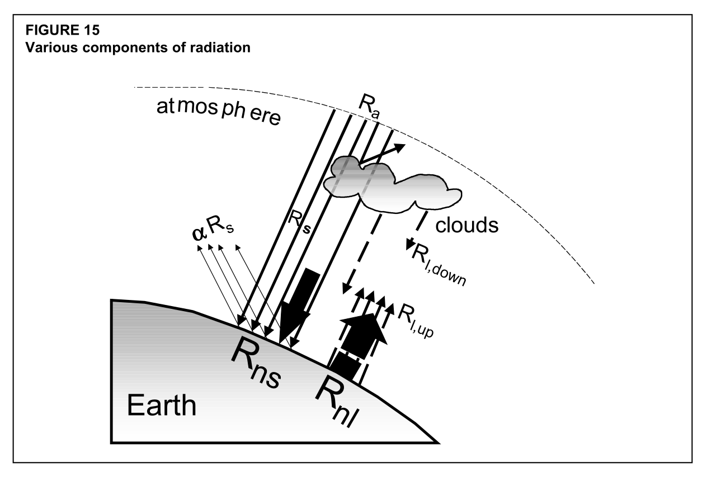
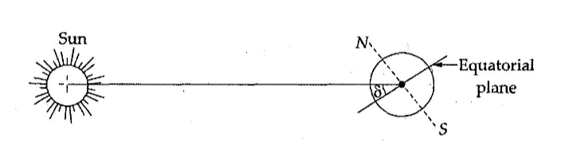
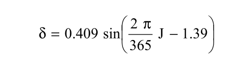
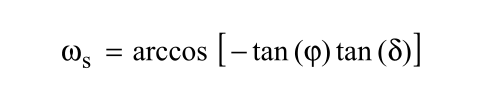

## Геометрия процесса внеземного излучения

> Первоначально текст написан в качестве девлога — **необязательного приложения к журналу разработки** открытого встраиваемого программного обеспечения для автономных полевых иррагационных систем, точнее — в процессе разработки **архитектурного модуля**, вычисляющего значение внеземного излучения. Сам проект находится на этапе разработки, ссылка на него появится здесь позже.

* * *

> Этот девлог целиком посвящен объяснению **физического смысла и геометрических аспектов** как самого процесса, так и процесса вычисления эвапотранспирации в его связи с внеземной радиацией (космическим излучением). Этот девлог можно использовать для лучшего понимания технической документации *FAO56*, однако анализ кода и математической модели физического процесса, положенной в основу нашего кода, лучше проводить на основе документации *FAO56*. Этот девлог, в конечном счете, нужен лишь для того, чтобы лучше понимать устройство самого физического процесса, в который впоследствии будет встраиваться разрабатываемая нами кибер-физическая система. Фокус на **внеземном излучении** выбран здесь потому, что из-за тригонометрических и астрономических аспектов оно представляется наиболее трудным для понимания, и это ведет к затруднению в связном взгляде на процесс эвапотранспирации в целом. Этот девлог посвящается памяти [**Джона Монтейта**](https://en.wikipedia.org/wiki/John_Monteith), хранящейся в его работах.

* * *

> Ссылки на уравнения и диаграммы приводятся по [первому изданию](https://www.fao.org/4/x0490e/x0490e00.htm) документации *FAO56* 1998 года. В 2025 году появилось первое [пересмотренное издание](https://agrhysmo.agr.unipi.it/wp-content/uploads/2025/09/FAO56%202025.pdf) документации. Все ссылки в этом девлоге сверены с новой версией документации.

* * *

### Введение

В основе всех вычислений **эталонной эвапотранспирации** (*reference evapotranspiration, RET, ETo*) лежит простая физическая реальность: Земля непрерывно получает **поток энергии** от Солнца. Такие процессы, как нагрев воздуха и почвы, испарение воды, биофизическая деятельность растений, движение атмосферы, являются следствиями перераспределения этой энергии. С точки зрения системного и прикладного взгляда на экологические процессы, **внеземное излучение** (*extraterrestrial radiation, Ra*) является фундаментальным **энергетическим входом системы**, который может быть описан количественно. В свою очередь количественные характеристики энергетического входа системы напрямую связаны с **геометрией физического движения** небесных тел.

* * *

### Источник энергии

В ядре Солнца происходит термоядерный синтез: сотни миллионов тонн водорода превращаются в гелий, а часть массы вещества, несколько миллионов тонн, переходит в энергию по соотношению Эйнштейна *E = mc2*. Постепенно, за сотни тысяч лет, эта энергия перемещается от ядра к поверхности Солнца и выходит вовне в виде электромагнитного излучения — фотонов разных длин волн: от ультрафиолета до инфракрасного диапазона.

Солнце излучает энергию почти равномерно во всех направлениях. На расстоянии орбиты Земли поток энергии распределен по сфере радиусом около 150 миллионов километров. Если измерить, сколько энергии в единицу времени падает на единицу площади, расположенной перпендикулярно солнечным лучам **на верхней границе атмосферы**, получим число, называемое **солнечной постоянной** (*solar constant, Gsc*): 0.0820 МДж на квадратный метр в минуту, или около 1361 Вт/м2. Иными словами, на каждый квадратный метр поверхности верхней границы земной атмосферы, расположенной перпендикулярно солнечным лучам, приходится небольшая часть общего солнечного потока.

Солнечная постоянная — исходная точка всех расчетов потока радиации в *FAO56*. Остальное в уравнении *Ra* — геометрия, точнее, **тригонометрия и астрономия**: уточнение того, как именно поток энергии направлен к горизонтальной поверхности в той или иной точке Земли в конкретный день или час. (Дальнейшие параграфы подробнее раскроют роль этих уточнений.)

После прохождения верхней границы атмосферы в дело вступают облака, водяной пар, аэрозоли, рассеяние, альбедо, поток тепла в почву и прочее, что позволяет выделить различные компоненты от входного потока радиации и в конечном счете получить значение **чистой радиации** (*net radiation at the crop surface, Rn*) — и использовать его в расчете эталонной эвапотранспирации.

Приведем иллюстрацию, позволяющую наглядно представить входной поток радиации с дальнейшим разделением его на компоненты системы (*FAO 1998: 44, fig. 15*):

> С точки зрения математической модели физического процесса и с точки зрения нашей программы для вычисления эталонной эвапотранспирации, **модуль внеземного излучения Ra** отвечает на единственный вопрос (впрочем, предполагающий ряд деривативов для его постановки): **какое количество солнечной энергии в принципе, или на входе, доступно для данной географической широты в данный день или час года, если принять во внимание только положение Земли относительно Солнца?**

* * *

### Уточнение первое: орбита и удаленность Солнца от Земли

Земля вращается вокруг Солнца не по окружности, а по эллипсу. Разница не столь велика, но она есть: эксцентриситет орбиты составляет около 0.017. В начале января Земля находится ближе к Солнцу примерно на 3.3% (перигелий), чем в начале июля (афелий). Поскольку интенсивность излучения убывает с квадратом расстояния, поток энергии, достигающий верхней атмосферы Земли, меняется в течение года примерно на 6‒7%.

В документации (*FAO 1998: 46, eq. 23*) эта поправка к уравнению *Ra* введена как **обратное относительное расстояние Земля–Солнце** (*inverse relative distance Earth–Sun, dr*):

Здесь *J* — номер дня года от 1 до 365 или 366 для високосного года. Когда значение *J* близко к 1, косинус близок к 1, и *dr* > 1: Земля находится ближе к Солнцу (январь, перигелий), поток энергии сильнее. Когда *J* ≈ 182, косинус отрицательный, *dr* < 1: Земля расположена дальше от Солнца (июль, афелий), поток энергии слабее. Амплитуда поправки составляет 0.033, то есть упомянутые ранее ±3.3% от единицы, и вводится в уравнение в качестве константы.

Эта переменная входит в итоговое уравнение *Ra*, которое мы приведем позднее, как прямой множитель: чем больше расстояние от Земли до Солнца, тем меньше значение поступающей энергии.

* * *

### Уточнение второе: наклон земной оси

Более существенно влияет на сезонность не эллиптичность земной орбиты, а наклон земной оси. По отношению к плоскости орбиты земная ось наклонена под углом примерно 23.45°. Этот наклон порождает смену времен года: летом Солнце поднимается выше над горизонтом и светит дольше, а зимой — ниже и короче.

Можно представить вид на Солнечную систему «сбоку»: в июне Северный полюс наклонен к Солнцу — лучи падают на северное полушарие более отвесно, продолжительность светового дня оказывается длиннее. В декабре ситуация для того же полушария обратная. На экваторе смена гораздо слабее, поскольку лучи всегда падают почти вертикально, и разница между летом и зимой минимальна.

В документации (*FAO 1998: 46, eq. 24*) эта поправка к уравнению *Ra* введена как **солнечное склонение** (*solar declination, δ*):

Солнечное склонение — это угол между экватором Земли и прямой, соединяющей центры Земли и Солнца, или угловое положение Солнца относительно земного экватора. Иными словами, *δ* показывает, над какой географической широтой Земли Солнце находится в зените в полдень данного дня года *J*. Солнечное склонение измеряется в радианах.

В день летнего солнцестояния (*J* ≈ 172) *δ* ≈ +0.409 рад ≈ +23.45°: Солнце в зените над тропиком Рака. В день зимнего солнцестояния (*J* ≈ 355) *δ* ≈ −23.45°: Солнце в зените над тропиком Козерога. В дни равноденствий (*J* ≈ 80, *J* ≈ 264) *δ* ≈ 0: Солнце в зените над экватором.

Вводимая в уравнение константа 0.409 — это и есть наклон земной оси 23.45°, записанный в радианах. Фазовый сдвиг −1.39 рад, введенный в уравнение, смещает максимум склонения на июнь, поскольку уравнение отсчитывает *J* от 1 января, а не от равноденствия.

* * *

### Уточнение третье: географическая широта

**Географическая широта** (*latitude, φ*) определяет угол, под которым солнечные лучи падают на горизонтальную поверхность в данной точке Земли. Измеряется в радианах.

На широте земного экватора солнечные лучи в среднем падают почти отвесно, *φ* = 0. Чем дальше от экватора и чем ближе к полюсам, тем более косо падают на Землю солнечные лучи, тем по большей площади они распределяются и тем меньше энергии приходится на каждый участок поверхности (МДж на квадратный метр в минуту). Высокие широты получают меньше энергии на квадратный метр. На Северном полюсе *φ* = +90° = *+π*/2 рад, на Южном полюсе *φ* = −90° = *−π*/2 рад. Плюс здесь указывает на широты Северного полушария, а минус — на широты Южного.

В тестовом наборе нашей программы вслед за документацией *FAO56* мы используем эталонные значения для расчета внеземной радиации на широтах Бангкока (*φ* ≈ +13.73°) и Рио-де-Жанейро (*φ* ≈ −22.90°).

В уравнении *Ra*  эти отношения появляются в виде суммы тригонометрических произведений *sin(φ) × sin(δ) + cos(φ) × cos(δ)* — геометрической записи проекции солнечного луча на горизональную поверхность, или угла между солнечным лучом и нормалью к горизонтальной поверхности на данной широте. Заметим вновь, что речь идет о **верхней границе атмосферы**, об энергетическом входе системы, а не о геодезической поверхности Земли.

Чтобы получить значение *φ* в радианах для использования его в уравнении *Ra*, зная только географическую широту, можно воспользоваться следующим вычислением (*FAO 1998: 46, eq. 22*):

> Рассмотрим вычисление на примерах (*FAO 1998: 46, ex. 7*). Бангкок имеет географические координаты 13°44′*N*, то есть 13 градусов и 44 минуты северной широты. Переведем сперва эти координаты с градусами и минутами — в **десятичную форму записи градусов** (*decimal degrees*): 13 + 44/60 = +13.73°. Теперь умножим *π*/180 на полученное десятичное значение: (*π*/180) × 13.73 ≈ +0.240. Значение *φ* **в радианах** для Бангкока ≈ +0.240 рад. Для Южного полушария, например, для широты Рио-де-Жанейро 22°54′*S*, значения координат в градусах и минутах берутся с отрицательным знаком: (−22) + (−54/60) или −(22 + 54/60) = −22.90° в десятичной записи. И далее: (*π*/180) × (−22.90) ≈ −0.400 рад. Обратный перевод из значения радиан в значение десятичных градусов возможен через замену: 180/*π*.

* * *

### Уточнение четвертое: продолжительность солнечного сияния

Поскольку Земля вращается вокруг своей оси, с точки зрения наблюдателя на поверхности Земли Солнце движется по небосводу. Утром Солнце восходит на востоке, в полдень находится на максимальной высоте, вечером заходит на западе. Важную роль для вычисления потока входящей энергии имеет то, сколько времени Солнце находится над горизонтом в данной географической точке в данный день года.

Угол, на который Земля поворачивается вокруг своей оси за промежуток времени от момента истинного полдня до момента заката, называется **часовым углом заката** (*sunset hour angle, ωs*), измеряется в радианах и рассчитывается по [формуле](https://en.wikipedia.org/wiki/Sunrise_equation) (*FAO 1998: 46, eq. 25*):

Физически *ωs* — это **угловая мера половины светового дня**. В момент истинного полдня Солнце проходит местный меридиан и часовой угол равен нулю. Земля продолжает вращение, Солнце с точки зрения наблюдателя смещается к западу, и к моменту заката оказывается, что Земля по отношению к истинному полудню совершила поворот на угол *ωs*.

Если бы день всегда длился ровно 12 часов, то от полудня до заката Земля поворачивалась бы ровно на четверть полного оборота: 90° = *π*/2. Однако из-за наклона земной оси и зависимости траектории движения Солнца по небосводу от географической широты, на которой расположен наблюдатель на поверхности Земли, значение *ωs* меняется в течение года и на разных широтах.

Формула нахождения *ωs* берется из элементарной сферической тригонометрии. Солнце находится на горизонте, когда его высота над горизонтом равна нулю. Условие нулевой высоты записывается через широту *φ* и склонение *δ* — и после алгебраических преобразований дает такое выражение.

> Подробнее см., например, разделы «2.2. Экваториальная система координат», «2.7. Восход и заход небесных тел» в книге: *Жаров В.* [Сферическая астрономия](https://iaaras.ru/media/library/zharov_sf.pdf), 2006.

Используя значение *ωs* можно получить значение **продолжительности светового дня в часах** (*maximum possible duration of sunshine or daylight hours, N*) следующим образом (*FAO 1998: 48, eq. 34*):

Это простой перевод угловой меры вращения Земли во временную, из радиан в часы. Полный оборот Земли за 24 часа соответствует 2*π* радианам: 2*π* рад = 24 ч. Следовательно, угол *ωs* соответствует промежутку времени от полудня до заката, а полный световой день — удвоенному значению этого угла: 2*ωs*.

На схеме выше видно, что **часовой угол является угловой мерой солнечного времени, связанной с вращением Земли**. Например, углу *ω* = 45° соответствует разница в 3 часа солнечного времени между истинным полднем в 12 *hr solar time* и положением Солнца в 9 *hr solar time*. Поскольку Земля совершает полный оборот 360° за 24 часа, каждому часу соответствует поворот примерно на 15°.

В Бангкоке (*φ* ≈ +13.7°) и Рио (*φ* ≈ −22.9°) продолжительность дня 3 сентября почти одинакова, поскольку дата близка к осеннему равноденствию: в обоих случаях солнечная дуга над горизонтом близка к симметричной относительно экватора, а продолжительность дня близка к 12 часам.

Если аргумент *arccos* выходит за пределы [−1, +1], это означает, что Солнце либо вообще не заходит (полярный день, *ωs* = *π*, *N* = 24), либо вообще не встает (полярная ночь, *ωs* = 0, *N* = 0, *Ra* = 0).

> Именно поэтому наша программа в функции `DayCalc_Update` содержит явную проверку аргумента *arccos* — это не столько предосторожность при проверке граничных значений, сколько включение в вычисления физических условий для полярных широт.

* * *

### Линковка уравнения внеземной радиации

Соберем теперь целиком уравнение внеземного излучения **для периода продолжительностью в световой день** (*FAO 1998: 46, eq. 21*):

> Для вычисления почасовых и более коротких периодов *Ra* уравнение в целом аналогично, в него только добавляется разность значений часовых углов (*solar time angles*) в начале (*ω1*) и в конце (*ω2*) рассматриваемого периода вместо единого *ωs*. Способ их нахождения описан в документации (*FAO 1998: 47, eq. 28; 48, eq. 29, 30*).

Прочитаем уравнение с точки зрения его физического смысла.

Элемент 24 × 60 / *π* = 1440/*π* означает перевод из «энергии за минуту на квадратный метр» в суточный интеграл, «энергию за сутки», то есть за 1440 минут.

Произведение *Gsc × dr* означает интенсивность солнечного потока на верхней границе атмосферы в данный день с учетом поправки на эксцентриситет орбиты.

Выражение *ωs × sin(φ) × sin(δ) + cos(φ) × cos(δ) × sin(ωs)* представляет результат интегрирования косинуса угла падения солнечных лучей на горизонтальную поверхность за весь световой день. Это означает, что суточная траектория движения Солнца по небосводу, то есть изменение угла падения солнечных лучей во времени, учитывается как интеграл по часовому углу от *−ωs* до *+ωs*. При интегрировании возникают два слагаемых. Первое содержит произведение *sin (φ) × sin (δ)* и связано с положением Солнца относительно горизонта. Второе содержит произведение *cos (φ) × cos (δ) × sin (ωs)* и связано с суточным движением Солнца и продолжительностью светового дня. Вместе оба компонента описывают геометрию того, как именно солнечное излучение поступает на горизонтальную поверхность в течение суток.

* * *

## Постскриптум: фотосинтез и транспирация

Эвапотранспирация начинается с потока солнечной энергии, достигающего верхней границы атмосферы Земли. Затем эта энергия проходит через систему «почва — растение — атмосфера», распределяясь между несколькими взаимосвязанными потоками вещества и энергии. Этот непрерывный обмен определяет водный баланс территории и доступность влаги для растений (*FAO 1998: 12, fig. 6*).

Вычисление эвапотранспирации в конечном счете носит прикладной характер и связано с решением **практических задач ирригации** и управления водными ресурсами. Сельскохозяйственная культура постоянно теряет влагу двумя путями: через **испарение** с поверхности почвы (*evaporation*) и через **транспирацию** растений (*transpiration*). Суммарный процесс этих потерь называется **эвапотранспирацией** (*evapotranspiration*).

Испарение представляет собой переход воды из жидкого состояния в газообразное с последующим удалением водяного пара в атмосферу. Этот процесс происходит на любых влажных поверхностях: почве, листьях, водоемах, строительных материалах и прочих. Для превращения жидкой воды в водяной пар необходим приток энергии, достаточный для разрыва водородных связей между молекулами. Основным источником этой энергии является солнечная радиация. Дополнительную, но менее существенную роль играет температура окружающего воздуха. Однако для испарения одного только подвода энергии недостаточно — чтобы испарение продолжалось, образующийся водяной пар должен удаляться с поверхности. Если воздух рядом с поверхностью становится слишком влажным, испарение замедляется. Важную роль играет **движение воздуха**: ветер удаляет насыщенный водяным паром воздух и заменяет его более сухим, поддерживая **градиент парциального давления водяного пара** между поверхностью и атмосферой.

Транспирация представляет собой процесс потери влаги, протекающий внутри растительной системы. В некотором смысле решение практических задач ирригации связано с тем, что почти вся вода, поглощаемая растением, в конечном счете возвращается в атмосферу в виде водяного пара и лишь незначительная ее часть используется непосредственно в биохимических процессах. **Растение постоянно нуждается в воде, которую оно почти не использует, но непрерывно теряет.**

Здесь хочется выяснить, почему так происходит, показать место этого процесса в общем потоке энергии, а также сделать несколько необязательных предположений с точки зрения инженерии.

* * *

В процессе **фотосинтеза** — получения углерода из атмосферного *CO2* — растение сталкивается с принципиальной проблемой. Чтобы получить *CO2*, нужно открыть **устьица** (*stomata*) — микроскопические поры в листьях, через которые углекислый газ поступает внутрь листа. Однако атмосфера почти всегда суше внутреннего пространства листа, поэтому при открытии устьиц возникает сильный градиент, наружу начинает диффундировать водяной пар, и поглощенная корнями влага переходит от растения в атмосферу (*FAO 1998: 2, fig. 1*). Транспирация является ценой фотосинтетического газообмена.

Рассмотрим подробнее устройство этого процесса.

Корни поглощают влагу из почвы главным образом за счет **разности водного потенциала**. Почва обычно содержит воду сравнительно более доступную, чем ткани растения, так что вода движется внутрь корня **осмотически**. Затем она попадает в **ксилему** — систему проводящих сосудов растения, нечто вроде непрерывной гидравлической сети, идущей от корней к листьям.

Подъем жидкости вверх требует преодоления гравитации. Животные для этого используют сердце, создающее давление. У растений такого органа нет, и подъем воды создается сверху: когда в листьях вода испаряется в межклеточное пространство и затем выходит через устьица в атмосферу, в водной колонне ксилемы возникает **натяжение** (*tension*). Поскольку молекулы воды сцеплены между собой **водородными связями** (*cohesion*), испарение влаги с листа тянет снизу вверх весь водяной столб. Этот молекулярный конвейер работает по принципу **капиллярно-испарительной системы** (*cohesion-tension mechanism*). Основная энергия, поддерживающая этот процесс в масштабе всей системы, поступает от потока солнечного излучения.

Как сказано выше, вода используется растением лишь в незначительной степени: она участвует в фотосинтезе, входит в состав клеток и поддерживает тургор тканей, используется в биохимических реакциях и транспорте минеральных веществ. Основная масса воды проходит через растение транзитом. Если смотреть на растение как на биохимический автомат, такая организация процесса представляется досадной недоработкой. Однако растение представляет собой еще и **тепловую систему**. Чтобы перевести жидкую воду в пар, нужно затратить **скрытую теплоту парообразования** (*latent heat of vaporization*). Эта энергия забирается у листа. Без транспирации листья под потоком солнечного излучения быстро перегревались бы до температур, повреждающих аппарат фотосинтеза. Таким образом, транспирация выполняет функцию охлаждения и поддержания потока тепла. Растение постоянно балансирует между потерей воды и получением углерода, охлаждением и риском перегрева и обезвоживания.

Транспирация является частью глобального круговорота вещества и энергии, а **растение играет роль важнейшего «интерфейса» в управлении потоками**, перенося воду из почвы в атмосферу, охлаждая поверхность суши, влияя на влажность воздуха, участвуя в формировании облаков и осадков, преобразуя солнечную энергию в химическую.

* * *

Если смотреть на растение как на автомат преобразования солнечной энергии и углекислого газа в биомассу, обычные сельскохозяйственные культуры кажутся слишком расточительными с точки зрения расхода воды. Для фиксации одного моля *CO2* вследствие физики газообмена растение теряет через устьица сотни молей воды.

В первую очередь сами растения пробовали решать проблему «развязки» воды и *CO2* посредством разных стратегий. К примеру, кукуруза, сахарный тростник, сорго используют механизм, называемый ***C4*-фотосинтезом** (*C4 carbon fixation*). С точки зрения транспирации, его идея состоит в том, чтобы сперва концентрировать *CO2* во внутренних тканях, а уже потом использовать его в цикле Кальвина в процессе фотосинтеза, что позволяет не держать устьица все время открытыми и, следовательно, ведет к меньшей потере воды (такой механизм, среди прочего, позволяет лучше адаптироваться к жаре и сильному излучению). Другую стратегию — ***CAM*-фотосинтез** (*crassulacean acid metabolism, CAM photosynthesis*) — используют кактусы, агава, суккуленты, ананас и ваниль. Здесь идея заключается в том, чтобы открывать устьица ночью, когда температура воздуха прохладнее, влажность выше, испарение слабее. Ночью растение запасает *CO2* в виде органических кислот, а днем держит устьица почти закрытыми, используя для фотосинтеза запасенный *CO2*. Правда, цена такой стратегии — серьезные энергетические ограничения — медленный рост, невысокая скорость фотосинтеза, низкая продуктивность.

Возможно ли биоинженерное решение проблемы потери влаги в процессе транспирации, или человеческая инженерия в некотором смысле обречена на то, чтобы обслуживать расточительность растений, переводя эту проблему в решение прикладных задач ирригации — в решение *проблемы среды*?

Представляется, что нужно решить хотя бы одну из описанных фундаментальных проблем удержания влаги растением. К примеру, пойти путем разработки более эффективных аналогов *C4*-фотосинтеза или *CAM*: научиться быстро захватывать *CO2*, удерживать его внутри растения, регулировать открытие устьиц, сводя его к минимуму. На ум приходят попытки встроить *C4*-механизмы в рис, инженерия «умных» устьиц, усиление механизмов концентрации *CO2*. Или, например, подумать о том, как можно было бы отводить энергию, избегая процесс транспирации, скажем, через разработку другой архитектуры или микроструктуры листа, пригодного для конвективного охлаждения. Возможно, стоит думать о создании масштабируемых искусственных фотосинтетических систем, работающих в закрытых циклах.

Так или иначе, главной «проблемой» является то, что является и главной особенностью растения как активного компонента биосферы: **растение встроено в планетарную физику** и не является обособленным автоматом. Транспирация — не дефект устройства растения, а следствие того, каким образом наземная фотосинтезирующая жизнь встроена в обмен веществом и энергией между сушей и атмосферой. Через испарение растения рассеивают значительную долю энергии излучения, приходящейся на поверхность суши. Можно представить биосферу без транспирации: поверхность суши нагревается, изменяются облачные процессы, осадки, атмосферная циркуляция, климат.

Кажется, что вопросы эффективности ирригации и управления водными ресурсами в сельском хозяйстве имеют свои пределы — главным образом в постановке проблемы потоков *исходя из среды*. Вероятно, дальние решения будут связаны с тем, чтобы разъединить потоки внутри самих физических механизмов жизни.

* * *
