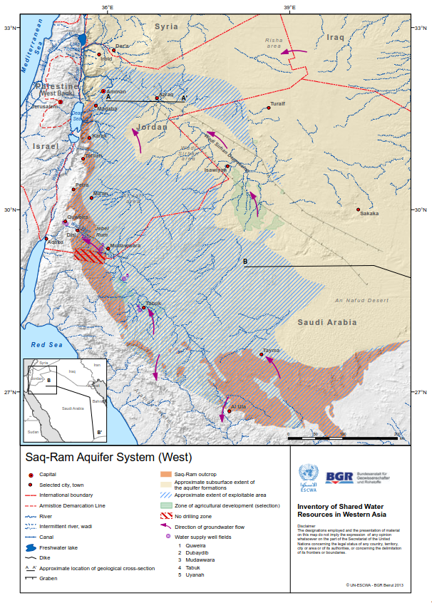
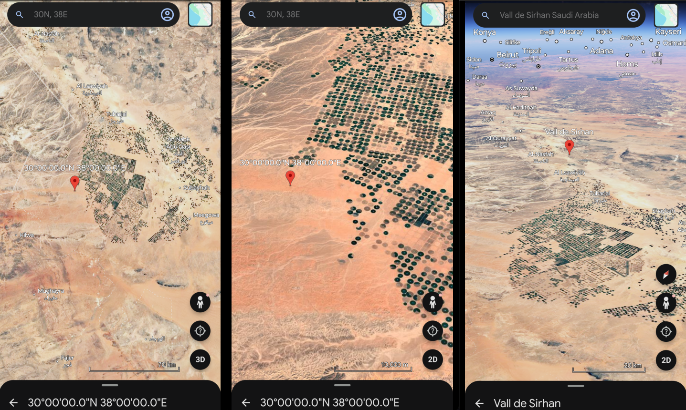

## Несколько координатных проекций

Северная Азия, Западная Сибирь, город Нижневартовск: координаты ≈ 60°56′*N*, 76°34′*E*.

С точки зрения «восточности», примерно на том же меридиане находятся города: Кашгар (Китай) 75°59′*E*; Дели (Индия) 77°13′*E*; Бангалор (Индия) 77°34′*E*.

С точки зрения «северности», примерно на той же параллели находятся города: Санкт-Петербург (РФ) 59°57′*N*; Хельсинки (Финляндия) 60°10′*N*; Стокгольм (Швеция) 59°20′*N*; Осло (Норвегия) 59°54′*N*; Берген (Норвегия) 60°23′*N*; Анкоридж (Аляска, США) 61°13′*N*; Магадан (РФ) 59°34′*N*.

На половине пути от Нижневартовска на запад к нулевому меридиану находится долгота ≈ 38°*E*. На этом меридиане находятся города: Пальмира (Сирия) 38°16′*E*; Аддис-Абеба (Эфиопия) 38°43′*E*.

На половине пути от Нижневартовска на юг к экватору находится широта ≈ 30°*N*. На этой параллели находятся города: Каир (Египет) 30°03′*N*; Новый Орлеан (Луизиана, США) 29°58′*N*.

Половина пути между Нижневартовском и Гринвичем, пройденная в противоположную сторону, на восток ≈ 114°*E*. На этом меридиане находится город Гонконг (Китай) 114°09′*E*.

* * *

При совмещении двух последних шагов, на юг и на восток от Нижневартовска, получается координата ≈ 30°*N*, 114°*E*. На пересечении этих параллели и меридиана находится город Ухань (Китай) 30°35′*N*, 114°17′*E*.

При аналогичном шаге движения от Нижневартовска на юг и на запад окажемся на южной оконечности Сирийской пустыни, в Саудовской Аравии недалеко от границы с Иорданией, в точке с координатами 30°*N*, 38°*E*. Рассматривая этот участок Земли со спутника, можно заметить необычное, «неестественное» замощение поверхности пустыни симметричными кругами зеленого цвета. Координата указывает в очень необычное место, в тектоническую впадину [Вади ас-Сирхан](https://en.wikipedia.org/wiki/Wadi_Sirhan) (*Wadi Sirhan*), расположенную между каменистым плато Хамад в сердце Сирийской пустыни (на севере и востоке) и песчаной пустыней Большой Нефуд (на юге). Вади ас-Сирхан образовался в результате разломов и представляет собой нечто вроде «низменности» среди более высоких плато, отчего здесь скапливается вода — как поверхностная, так и подземная. Зеленые круги посреди пустыни — не что иное как огромный искусственный оазис, а с точки зрения инженерии — сооружения круговой ирригации (*center-pivot irrigation*). В центре каждого круга находится скважина, которая качает воду из глубоких подземных водоносных горизонтов (в частности, [*Saq aquifer*](https://www.tandfonline.com/doi/abs/10.1080/02626669609491539), или [*Saq-Ram aquifer system*](https://waterinventory.org/sites/waterinventory.org/files/chapters/Chapter-10-Saq-Ram-Aquifer-System-web.pdf)). С точки зрения геологии, это [«ископаемая» вода](https://en.wikipedia.org/wiki/Fossil_water) (*fossil water*), скопившаяся там за тысячи лет, когда климат Аравии был влажным. Вокруг центра, аналогично ходу стрелки часов, движется механизм, распыляя воду. Вади ас-Сирхан — пример экстремальной инженерии и оригинальной технической культуры, вообще говоря, характерной для [аридных зон](https://publ.lib.ru/ARCHIVES/P/%27%27Priroda_mira%27%27_(seriya)/_PM.html#0006): в пустыне, чтобы выращивать зерновые, фрукты и овощи, нужно решать задачу минимизации [испарения воды](https://github.com/cloclacordis/applied-ecology-notes/blob/main/notes/01-evapotranspiration-and-radiation.md), а не только ее добычи и оптимального расхода.

* * *

С точки зрения долготы, город Будапешт (Венгрия) 19°05′*E* находится на расстоянии ≈ 3/4 пути на запад от Нижневартовска до нулевого меридиана, или ≈ 1/4 от Гринвича к Нижневартовску, если двигаться с запада на восток: 76°*E* × 0.25 = 19°*E*.

Аналогично пройденные ≈ 3/4 пути на юг от Нижневартовска к экватору, с точки зрения широты, показывают параллель 60° × 0.25 = 15°*N*. На этой широте находятся города: Сана (Йемен) 15°21′*N*; Хартум (Судан) 15°34′*N*, расположенный на месте слияния Белого и Голубого Нила.

* * *
